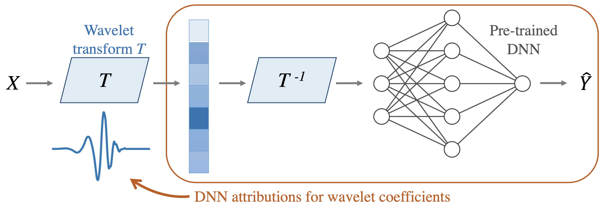

<h1 align="center"> Adaptive wavelet distillation 🌊</h1>

 Wavelets which adapt given data and a pre-trained model.

  
  
  
  

  

 <i> Faster and more interpretable. </i>

Official code for using / reproducing AWD from the paper "Adaptive wavelet distillation from neural networks through interpretations" ([arXiv](https://arxiv.org/abs/2107.09145)).

> Recent deep-learning models have achieved impressive prediction performance, but often sacrifice interpretability and computational efficiency. Interpretability is crucial in many disciplines, such as science and medicine, where models must be carefully vetted or where interpretation is the goal itself. Moreover, interpretable models are concise and often yield computational efficiency. Here, we propose adaptive wavelet distillation (AWD), a method which aims to distill information from a trained neural network into a wavelet transform. Specifically, AWD penalizes feature attributions of a neural network in the wavelet domain to learn an effective multi-resolution wavelet transform. The resulting model is highly predictive, concise, computationally efficient, and has properties (such as a multi-scale structure) which make it easy to interpret. In close collaboration with domain experts, we showcase how AWD addresses challenges in two real-world settings: cosmological parameter inference and molecular-partner prediction. In both cases, AWD yields a scientifically interpretable and concise model which gives predictive performance better than state-of-the-art neural networks. Moreover, AWD identifies predictive features that are scientifically meaningful in the context of respective domains.

# Related work

- TRIM (ICLR 2020 workshop [pdf](https://arxiv.org/abs/2003.01926), [github](https://github.com/csinva/transformation-importance)) - using simple reparameterizations, allows for calculating disentangled importances to transformations of the input (e.g. assigning importances to different frequencies)
- ACD (ICLR 2019 [pdf](https://openreview.net/pdf?id=SkEqro0ctQ), [github](https://github.com/csinva/hierarchical-dnn-interpretations)) - extends CD to CNNs / arbitrary DNNs, and aggregates explanations into a hierarchy
- CDEP (ICML 2020 [pdf](https://arxiv.org/abs/1909.13584), [github](https://github.com/laura-rieger/deep-explanation-penalization)) - penalizes CD / ACD scores during training to make models generalize better
- DAC (arXiv 2019 [pdf](https://arxiv.org/abs/1905.07631), [github](https://github.com/csinva/disentangled-attribution-curves)) - finds disentangled interpretations for random forests
- PDR framework (PNAS 2019 [pdf](https://arxiv.org/abs/1901.04592)) - an overarching framewwork for guiding and framing interpretable machine learning