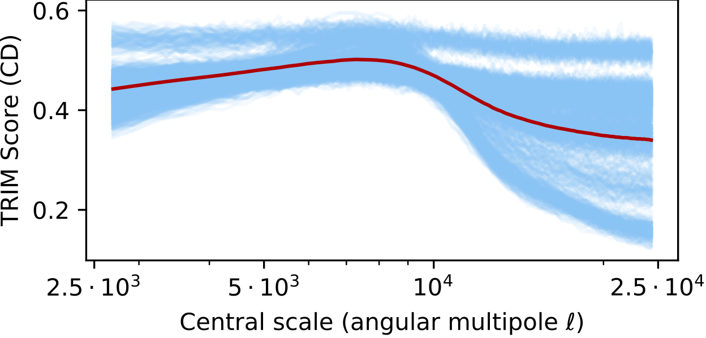

Official code for using / reproducing TRIM from the paper [Transformation Importance with Applications to Cosmology](https://arxiv.org/abs/2003.01926) (ICLR 2020 Workshop). This code shows examples and provides useful wrappers for calculating importance in a transformed feature space.

*This repo is actively maintained. For any questions please file an issue.*


# examples/documentation

- **dependencies**: depends on the pip-installable [acd package](https://github.com/csinva/hierarchical-dnn-interpretations)
- **examples**: different folders (e.g. [ex_cosmology](ex_cosmology), [ex_fake_news](ex_fake_news), [ex_mnist](ex_mnist), [ex_urban_sound](ex_urban_sound) contain examples for using TRIM in different settings)
- **src**: the core code is in the [trim](trim) folder, containing wrappers and code for different transformations
- **requirements**: tested with python 3.7 and pytorch > 1.0


| Attribution to different scales in cosmological images | Fake news attribution to different topics |
| ------------------------------------------------------ | ----------------------------------------- |
|                 |         |

| Attribution to different NMF components in MNIST classification | Attribution to different frequencies in audio classification |
| ------------------------------------------------------------ | ------------------------------------------------------------ |
|                                     |                             |

# sample usage

```python
import torch
import torch.nn as nn
from trim import TrimModel
from functools import partial

# setup a trim model
model = nn.Sequential(nn.Linear(10, 10), nn.ReLU(), nn.Linear(10, 1)) # orig model
transform = partial(torch.rfft, signal_ndim=1, onesided=False) # fft
inv_transform = partial(torch.irfft, signal_ndim=1, onesided=False) # inverse fft
model_trim = TrimModel(model=model, inv_transform=inv_transform) # trim model

# get a data point
x = torch.randn(1, 10)
s = transform(x)

# can now use any attribution method on the trim model
# get (input_x_gradient) attribution in the fft space
s.requires_grad = True
model_trim(s).backward()
input_x_gradient = s.grad * s
```
- see notebooks for more detailed usage

# related work

- this work is part of an overarching project on interpretable machine learning, guided by the [PDR framework](https://arxiv.org/abs/1901.04592)
- extends methods in ACD from the paper "[Hierarchical interpretations for neural network predictions](https://openreview.net/pdf?id=SkEqro0ctQ)" (ICLR 2019)
- see also the [github repo](https://github.com/laura-rieger/deep-explanation-penalization) for [CDEP](https://arxiv.org/abs/1909.13584), which penalizes these scores to improve models during training

# reference

- feel free to use/share this code openly
- if you find this code useful for your research, please cite the following:

```r
@article{singh2020transformation,
    title={Transformation Importance with Applications to Cosmology},
    author={Singh, Chandan and Ha, Wooseok and Lanusse, Francois, and Boehm, Vanessa, and Liu, Jia and Yu, Bin},
    journal={arXiv preprint arXiv:2003.01926},
    year={2020},
    url={https://arxiv.org/abs/2003.01926},
}
```