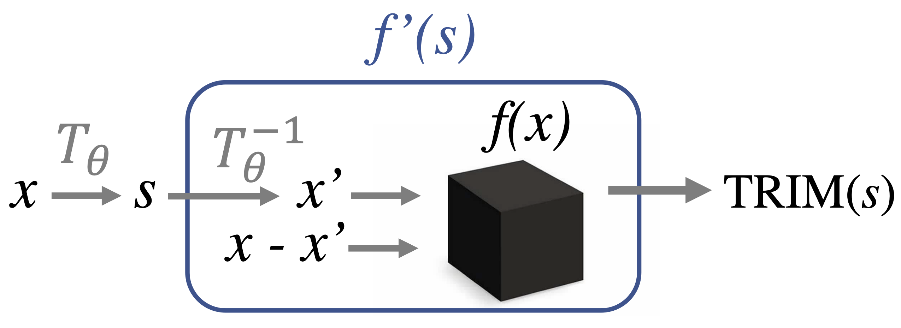
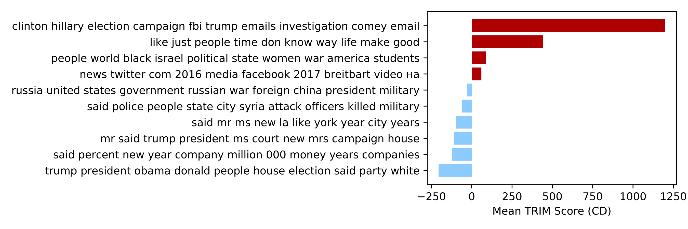
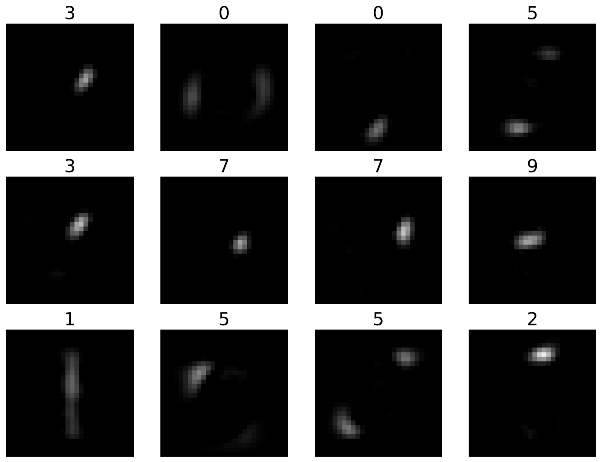
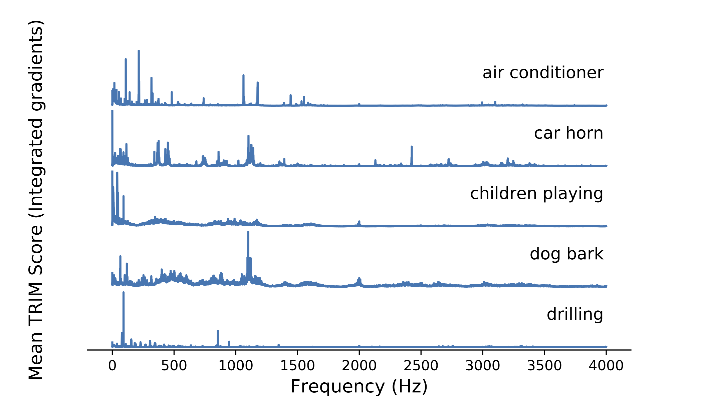

Official code for using / reproducing TRIM from the paper "Transformation Importance with Applications to Cosmology" (ICLR 2020 Workshop). This code shows examples and provides useful wrappers for calculating importance in a transformed feature space.

*This repo is actively maintained. For any questions please file an issue.*



# examples/documentation

- **dependencies**: depends on the pip-installable [acd package](https://github.com/csinva/hierarchical-dnn-interpretations)
- **examples**: different folders (e.g. [cosmology](cosmology), [fake_news](fake_news), [mnist](mnist), [urban_sound](urban_sound) contain examples for using TRIM in different settings)
- **src**: the core code is in the [trim](trim) folder, containing wrappers and codes for different transformations
- **requirements**: tested with python 3.7 and pytorch > 1.0


| Attribution to different scales in cosmological images | Fake news attribution to different topics |
| ------------------------------------------------------ | ----------------------------------------- |
|                    |            |

| Attribution to different NMF components in MNIST classification | Attribution to different frequencies in audio classification |
| ------------------------------------------------------------ | ------------------------------------------------------------ |
|                                        |                                |

# sample usage


# related work

- this work is part of an overarching project on interpretable machine learning, guided by the [PDR framework](https://arxiv.org/abs/1901.04592)
- extends methods in ACD from the paper "[Hierarchical interpretations for neural network predictions](https://openreview.net/pdf?id=SkEqro0ctQ)" (ICLR 2019)
- see also the [github repo](https://github.com/laura-rieger/deep-explanation-penalization) for [CDEP](https://arxiv.org/abs/1909.13584), which penalizes these scores to improve models during training

# reference

- feel free to use/share this code openly

- if you find this code useful for your research, please cite the following:

  ```c
    @inproceedings{
    singh2018hierarchical,
    title={Hierarchical interpretations for neural network predictions},
    author={Chandan Singh and W. James Murdoch and Bin Yu},
    booktitle={International Conference on Learning Representations},
    year={2019},
    url={https://openreview.net/forum?id=SkEqro0ctQ},
    }
  ```